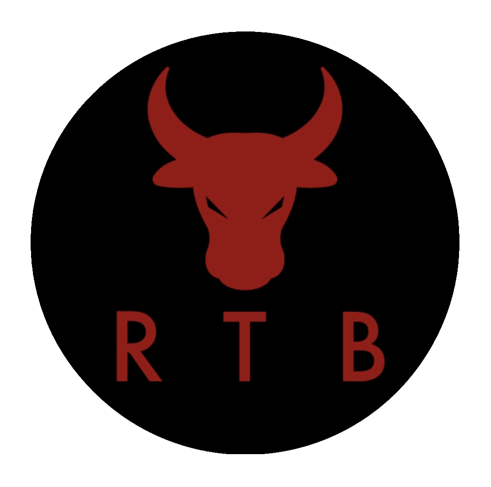

# RTBCoin-qt



RTBCoin-Qt is a Qt Wallet for RideTheBullCoin (RTB) 

Three OS platforms are Available:
• Windows
• Linux
• MacOS.

Use the following scripts to build:

• Linux: `build.sh` (native build)
• Windows: `build-win.sh` (cross-compilation for Win)
• MacOS: `build-mac-cross.sh` (cross-compilation for OSX)
• MacOS: `build-mac.sh` (native build)

## Tokenomics 
• Zero (0) Premine
• 50 RTB Initial Block Reward
• 17.4% Block Reward Reduction every 129,000 Blocks (Approx. 3 Months)
• 37,000,000 Maximum Supply
• 1 min block time
• 120 Block Coinbase Maturity

## Best Social 

Discord Server ([RTBCoin](https://discord.gg/xxxxxxx))

## How to build? ##

#### Linux

```shell
#The following packages are needed:
sudo apt-get install build-essential pkg-config libc6-dev m4 g++-multilib autoconf libtool ncurses-dev unzip git python3 bison zlib1g-dev wget libcurl4-gnutls-dev bsdmainutils automake curl
```

```shell
git clone https://github.com/RTBCoin/RTBCoin-QT
cd RTB
./zcutil/fetch-params.sh
# -j4 = using 4 threads for the compilation - replace 4 with number of threads you want to use
./zcutil/build-linux.sh -j4

```

#### OSX (Cross-compile)

Before start, read the following docs: [depends](https://github.com/bitcoin/bitcoin/blob/master/depends/README.md), [macdeploy](https://github.com/bitcoin/bitcoin/blob/master/contrib/macdeploy/README.md) .

Install dependencies:
```
sudo apt-get install curl librsvg2-bin libtiff-tools bsdmainutils cmake imagemagick libcap-dev libz-dev libbz2-dev python3-setuptools libtinfo5 xorriso
# sudo apt-get install libstdc++-$(g++ -dumpversion)-dev # in the event of errors occurring while building native_libtapi
```

Place prepared SDK file `Xcode-12.1-12A7403-extracted-SDK-with-libcxx-headers.tar.gz` in repo root, use `build-mac-cross.sh` script to build.

As an alternative you can download this file from [bitcoincore.org](https://bitcoincore.org/depends-sources/sdks/Xcode-12.1-12A7403-extracted-SDK-with-libcxx-headers.tar.gz).

#### OSX (Native)
Ensure you have [brew](https://brew.sh) and Command Line Tools installed.
```shell
# Install brew
/usr/bin/ruby -e "$(curl -fsSL https://raw.githubusercontent.com/Homebrew/install/master/install)"
# Install Xcode, opens a pop-up window to install CLT without installing the entire Xcode package
xcode-select --install 
# Update brew and install dependencies
brew update
brew upgrade
brew tap discoteq/discoteq; brew install flock
brew install autoconf autogen automake
# brew install gcc@6
brew install binutils
brew install protobuf
brew install coreutils
brew install wget
# Clone the RTBCoin-QT repo
git clone https://github.com/RTBCoin/RTBCoin-QT.git
# Change master branch to other branch you wish to compile
cd RTBCoin-QT
./zcutil/fetch-params.sh
# -j4 = using 4 threads for the compilation - replace 4 with number of threads you want to use
./zcutil/build-mac.sh -j8

```

macOS 12 (Monterrey) have incompatible version of Xcode `14.2` (Build version 14C18), to build on Monterrey you'll need to install the older version `13.2.1` using the following steps:

- Download the specific Xcode 13.2.1 version from [here](https://stackoverflow.com/questions/10335747) or [here](https://developer.apple.com/services-account/download?path=/Developer_Tools/Xcode_13.2.1/Xcode_13.2.1.xip).
- [Install](https://stackoverflow.com/questions/43663097/how-to-install-xcode-from-xip-file) it.
- To set default Xcode version run this command:
```
sudo xcode-select -switch /Applications/Xcode_13.2.1.app
```
- To check default Xcode version in your system use this command:
```
xcodebuild -version
```

#### Windows
Use a debian cross-compilation setup with mingw for windows and run:
```shell
sudo apt-get install build-essential pkg-config libc6-dev m4 g++-multilib autoconf libtool ncurses-dev unzip git python python-zmq zlib1g-dev wget libcurl4-gnutls-dev bsdmainutils automake curl cmake mingw-w64
curl https://sh.rustup.rs -sSf | sh
source $HOME/.cargo/env
rustup target add x86_64-pc-windows-gnu

sudo update-alternatives --config x86_64-w64-mingw32-gcc
# (configure to use POSIX variant)
sudo update-alternatives --config x86_64-w64-mingw32-g++
# (configure to use POSIX variant)

sudo bash -c "echo 0 > /proc/sys/fs/binfmt_misc/status" # build patch

git clone https://github.com/RTBCoin/RTBCoinQT.git
cd RTBCoin-QT
./zcutil/fetch-params.sh
# -j8 = using 8 threads for the compilation - replace 4 with number of threads you want to use
./zcutil/build-win.sh -j4

```
**RTB is experimental and a work-in-progress.** Use at your own risk.

*p.s.* Currently only `x86_64` arch supported for MacOS, build for `Apple M1` processors unfortunately not yet supported.

## Create RTB.conf ##

Before start the wallet you should [create config file](https://github.com/DeckerSU/RTBCoin/wiki/F.A.Q.#q-after-i-start-RTB-qt-i-receive-the-following-error-error-cannot-parse-configuration-file-missing-RTBconf-only-use-keyvalue-syntax-what-should-i-do) `RTB.conf` at one of the following locations:

- Linux - `~/.RTB/RTB.conf`
- Windows - `%APPDATA%\RTB\RTB.conf`
- MacOS - `~/Library/Application Support/RTB/RTB.conf`

With the following content:

```
txindex=1
rpcuser=RTB
rpcpassword=local321 # don't forget to change password
rpcallowip=127.0.0.1
rpcbind=127.0.0.1
server=1
```

Bash one-liner for Linux to create `RTB.conf` with random RPC password:

```
RANDPASS=$(tr -cd '[:alnum:]' < /dev/urandom | fold -w16 | head -n1) && \
tee -a ~/.RTB/RTB.conf << END
txindex=1
rpcuser=RTB
rpcpassword=${RANDPASS}
rpcallowip=127.0.0.1
rpcbind=127.0.0.1
server=1
END
```

## Developers of Qt wallet ##

- Main developer: **Ocean**
- IT Expert / Sysengineer: **Decker**
